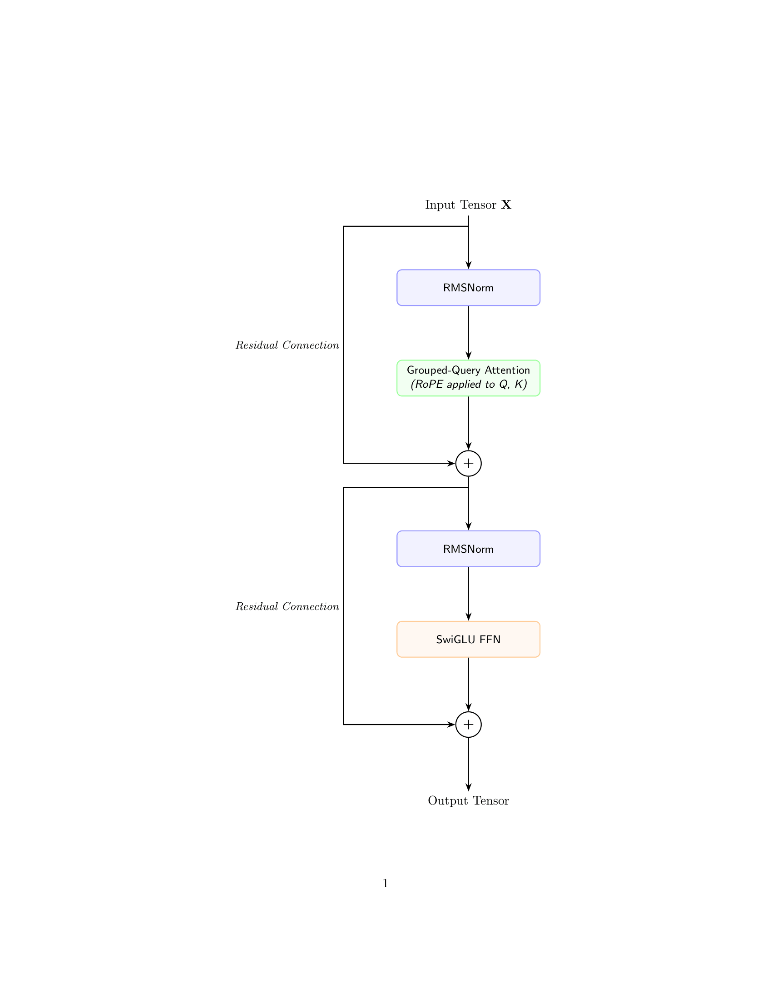
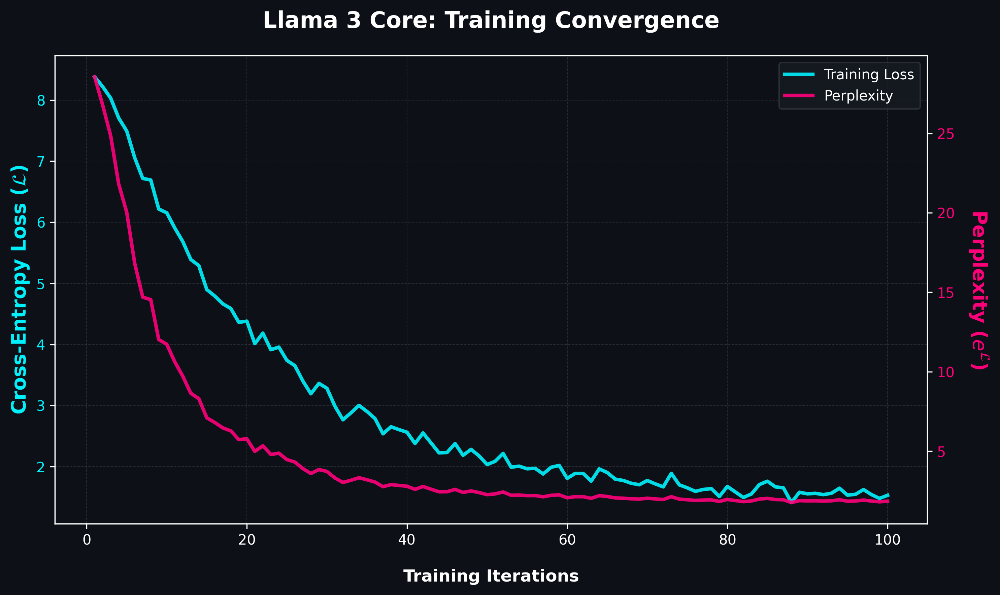

# Llama3-Scratch-Engine: First-Principles PyTorch Implementation

An elegant, from-scratch implementation of the Llama 3 architecture engineered purely in PyTorch. This engine completely bypasses high-level library abstractions to manually construct the foundational mathematical mechanics, multi-dimensional tensor routing, and autoregressive inference pipeline of modern frontier models from first principles.

### Key Architectural Highlights
* **Mathematical Purity:** Every layer—from tensor rotation in the complex plane to root-mean-square normalization—is derived and written manually.
* **Weight Realignment:** Features a custom loading script designed to extract official open-source weights (e.g., Llama 3.2 3B) and dynamically map parameter dictionary keys into this custom scratch execution engine.
* **O(1) Inference Scaling:** Implements a production-grade static KV-cache mechanism to achieve constant-time complexity per token generation, maximizing memory bandwidth efficiency.

---

## 1. Theoretical Architecture & Mathematical Derivations

### Grouped-Query Attention (GQA)
To resolve the massive memory bandwidth bottleneck imposed by the Key-Value (KV) cache during autoregressive decoding in standard Multi-Head Attention (MHA), this engine implements Grouped-Query Attention. 

Instead of maintaining independent $K$ and $V$ heads for every individual $Q$ head, query heads are partitioned into $G$ sequential groups. A single, shared Key and Value head serves all query heads assigned to that specific group, reducing memory traffic dynamically.

The mathematical formulation for the scaled dot-product attention of an individual query head $i$ mapped within group $g$ is derived as:

$$\text{Attention}(Q_i, K_g, V_g) = \text{softmax}\left(\frac{Q_i K_g^T}{\sqrt{d_k}}\right) V_g$$

Where:
* $Q_i \in \mathbb{R}^{B \times S \times 1 \times d_k}$ represents the projection of the $i$-th query head.
* $K_g, V_g \in \mathbb{R}^{B \times S \times 1 \times d_k}$ represent the shared key and value projections for group $g$.
* $d_k$ is the structural head dimension dictating the scaling factor.

### Rotary Positional Embeddings (RoPE)
To capture relative positional dependencies across variable sequence lengths without disrupting vector norms, this engine bypasses traditional absolute or learned position vectors. Instead, it implements Rotary Positional Embeddings (RoPE), which apply a structural rotation to the query and key vectors in the complex plane.

Given a two-dimensional vector $\mathbf{x} = (x_1, x_2)^T$ at a discrete sequence position $m$, the transformation is executed via an orthogonal rotation matrix $\mathbf{R}_{\Theta, m}^2$:

$$\mathbf{R}_{\Theta, m}^2 \mathbf{x} = \begin{pmatrix} \cos m\theta & -\sin m\theta \\ \sin m\theta & \cos m\theta \end{pmatrix} \begin{pmatrix} x_1 \\ x_2 \end{pmatrix}$$

For a full $d$-dimensional tensor, this rotation is applied piecewise across split pairs of the head dimension using a vector of frequency bounds $\Theta = \{\theta_i = 10000^{-2(i-1)/d}, i \in [1, d/2]\}$. This mathematically guarantees that the inner product of a query vector at position $m$ and a key vector at position $n$ is purely a function of their relative distance $m - n$:

$$\langle f_q(\mathbf{x}_m, m), f_k(\mathbf{x}_n, n) \rangle = \mathbf{g}(\mathbf{x}_m, \mathbf{x}_n, m - n)$$

https://github.com/user-attachments/assets/27a29c38-097c-4470-85e1-3122768cab25

### SwiGLU Activation Function
The feed-forward network (FFN) blocks are optimized using the Swish-Gated Linear Unit (SwiGLU) variant, which replaces standard non-linearities like ReLU or GELU to enhance training stability and representation capacity. 

The sub-graph utilizes three distinct weight tensors per layer ($\mathbf{W}_g$, $\mathbf{W}_1$, and $\mathbf{W}_2$) to construct a gated linear mechanism. The structural equation mapping an intermediate hidden state tensor $\mathbf{x}$ through the FFN block is defined as:

$$\text{SwiGLU}(\mathbf{x}) = \left( \text{Swish}(\mathbf{x}\mathbf{W}_1) \otimes \mathbf{x}\mathbf{W}_g \right) \mathbf{W}_2$$

Where the Swish activation function (or SiLU) acts as the continuous gating mechanism:

$$\text{Swish}(\mathbf{z}) = \mathbf{z} \cdot \sigma(\beta \mathbf{z}) = \frac{\mathbf{z}}{1 + e^{-\beta \mathbf{z}}}$$

---

## 2. Architectural Evolution (The Comparative Matrix)

To contrast the micro-architectural differences driving modern LLM topologies versus legacy implementations, the table below highlights the operational paradigms established in this core engine:

| Engine Component | Legacy Paradigm (e.g., GPT-2 Layout) | Modern Paradigm (Llama 3 Layout) | Mathematical & Practical Advantage |
| :--- | :--- | :--- | :--- |
| **Attention Routing** | **Multi-Head Attention (MHA):** Independent Key/Value channels per Query head. | **Grouped-Query Attention (GQA):** Query heads grouped to share underlying KV projections. | Drops the memory footprints of the active KV-cache by a factor equal to the group ratio, maximizing inference token throughput. |
| **Position Mapping** | **Absolute Encoding:** Coordinate vectors added linearly to initial token embeddings. | **Rotary Position (RoPE):** Multiplies tensor projections by rotation matrices dynamically. | Retains explicit relative spatial geometry and scales reliably past standard context length parameters without structural breakdown. |
| **Layer Normalization** | **Standard LayerNorm:** Centering operations relying on calculated sequence means and variances. | **Root Mean Square Norm (RMSNorm):** Normalizes values purely based on structural root mean squares. | Drops the mean calculation overhead completely, yielding a 10% to 50% increase in raw matrix computational speed. |
| **Activation Mechanics** | **Standard FFN:** Sequential linear transformations separated by singular ReLU/GELU steps. | **Gated Non-Linear FFN (SwiGLU):** Dual parallel projections combined via element-wise gating. | Provides an expressive, smooth gradient flow across deep hidden states, boosting overall parameter convergence. |

---

## 3. Training Dynamics & Evaluation Mathematics

To ensure structural convergence and numerical stability during the training loop or validation passes, the engine treats evaluation with strict mathematical boundaries.

### Loss Formulation & Vocabulary Distributions
The primary optimization target is the multi-class Cross-Entropy Loss, calculated over the sequence vocabulary distribution $V$. Given a batch of sequences, the loss $\mathcal{L}$ averages the negative log-likelihood of predicting the true target token $x_i$ out of the total token count $N$:

$$\mathcal{L} = -\frac{1}{N}\sum_{i=1}^{N}\log P(x_i \mid x_{<i}) = -\frac{1}{N}\sum_{i=1}^{N} \left( \mathbf{z}_{i}[x_i] - \log \sum_{j \in V} \exp(\mathbf{z}_{i}[j]) \right)$$

Where $\mathbf{z}_{i}$ represents the raw unnormalized logit vector outputted by the final linear layer for position $i$.

### Evaluation Metrics: Perplexity
While Cross-Entropy loss provides a differentiable surface for gradient descent, structural uncertainty is monitored through **Perplexity (PPL)**. Mathematically, perplexity represents the geometric mean of the inverse probability assigned to the correct tokens, calculated directly as the exponential of the cross-entropy loss:

$$\text{PPL} = \exp(\mathcal{L})$$

### Numerical Stability & Gradient Dynamics
To safeguard the network's deep linear paths against vanishing or exploding gradients during backpropagation, the training infrastructure natively implements explicit $L_2$ gradient norm tracking. If the unclipped gradient norm $\|\mathbf{g}\|_2$ exceeds a pre-defined threshold $c$, the updates are scaled down dynamically:

$$\mathbf{g} \leftarrow \mathbf{g} \times \min\left(1, \frac{c}{\|\mathbf{g}\|_2}\right) \quad \text{where} \quad \|\mathbf{g}\|_2 = \sqrt{\sum_{\theta \in \mathcal{W}} \|\nabla_{\theta} \mathcal{L}\|_2^2}$$

---

## 4. Tensor Topology & Engineering Obstacles

Building an LLM engine completely from scratch requires meticulous management of raw multi-dimensional memory footprints. Below are the primary technical bottlenecks solved during implementation:

* **Weight Mapping and Key Realignment:** Acquired pre-trained parameter weights from open-source repositories. Because structural parameter key naming conventions differ heavily from first-principles naming structures, a custom remapping script was engineered to parse the state dictionary, map alternative naming paradigms, and load weights without introducing shape mismatches.
* **Static KV-Cache Tensor Layouts:** Autoregressive generation natively scales at $\mathcal{O}(N)$ time complexity due to the repeated calculation of historic keys and values. To enforce a stable $\mathcal{O}(1)$ step footprint, a static tensor cache was built. This cache holds sequence shapes up to max context bounds, indexing past steps via dynamic coordinate slices rather than repeating allocation calls.
* **Dynamic Shape Alignment:** Tracing explicit structural transformations across multi-head splitting operations requires rigid dimension tracking to avoid silent broadcast errors. Tensor operations were traced strictly across `[Batch, Sequence, Heads, Head_Dim]` parameters, asserting specific boundary lengths throughout runtime execution to optimize underlying GPU execution paths.
